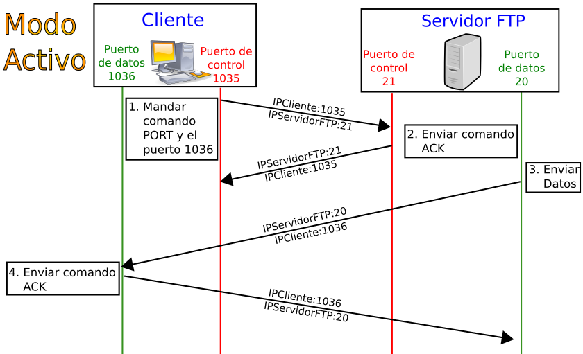

# FTP y Almacenamiento de Archivos

- [FTP y Almacenamiento de Archivos](#ftp-y-almacenamiento-de-archivos)
  - [FTP](#ftp)
    - [Conexiones Activas y Pasivas](#conexiones-activas-y-pasivas)
    - [Comandos FTP](#comandos-ftp)
    - [Códigos de Respuesta FTP](#códigos-de-respuesta-ftp)
    - [Ejemplo de uso de FTP](#ejemplo-de-uso-de-ftp)
- [Servidor VSFTPD](#servidor-vsftpd)
  - [VSFTPD con Docker](#vsftpd-con-docker)
    - [Configuración de un servidor FTP con Docker Compose](#configuración-de-un-servidor-ftp-con-docker-compose)
- [FTP con Srping Boot o similares](#ftp-con-srping-boot-o-similares)
    - [Controller](#controller)
    - [Service](#service)
    - [Ejemplo de uso de FTP con Spring Boot y Postman](#ejemplo-de-uso-de-ftp-con-spring-boot-y-postman)


## FTP
FTP (File Transfer Protocol) es un protocolo de red utilizado para la transferencia de archivos entre sistemas conectados a una red TCP/IP. FTP es un protocolo de la capa de aplicación, que utiliza el protocolo de control de transferencia de archivos para transferir archivos entre sistemas. FTP es un protocolo de red estándar utilizado para transferir archivos de un host a otro a través de una red TCP/IP, como Internet.

### Conexiones Activas y Pasivas
FTP utiliza dos conexiones TCP separadas para transferir archivos: una conexión de control y una conexión de datos. La conexión de control se utiliza para enviar comandos y recibir respuestas, mientras que la conexión de datos se utiliza para transferir archivos. FTP puede funcionar en modo activo o pasivo, dependiendo de cómo se establezcan las conexiones de datos.


- **Modo Activo**: En modo Activo, el servidor siempre crea el canal de datos en su puerto 20, mientras que en el lado del cliente el canal de datos se asocia a un puerto aleatorio mayor que el 1024. Para ello, el cliente manda un comando PORT al servidor por el canal de control indicándole ese número de puerto, de manera que el servidor pueda abrirle una conexión de datos por donde se transferirán los archivos y los listados, en el puerto especificado. Lo anterior tiene un grave problema de seguridad, y es que la máquina cliente debe estar dispuesta a aceptar cualquier conexión de entrada en un puerto superior al 1024, con los problemas que ello implica si tenemos el equipo conectado a una red insegura como Internet. De hecho, los cortafuegos que se instalen en el equipo para evitar ataques seguramente rechazarán esas conexiones aleatorias. Para solucionar esto se desarrolló el modo pasivo. Aunque realmente no es así ya que seguramente la seguridad tendrá un problema grave.

 

- **Modo Pasivo**: Cuando el cliente envía un comando PASV sobre el canal de control, el servidor FTP le indica por el canal de control, el puerto (mayor a 1024 del servidor. Ejemplo:2040) al que debe conectarse el cliente. El cliente inicia una conexión desde el puerto siguiente al puerto de control (Ejemplo: 1036) hacia el puerto del servidor especificado anteriormente (Ejemplo: 2040). Antes de cada nueva transferencia tanto en el modo Activo como en el Pasivo, el cliente debe enviar otra vez un comando de control (PORT o PASV, según el modo en el que haya conectado), y el servidor recibirá esa conexión de datos en un nuevo puerto (aleatorio si es en modo pasivo o por el puerto 20 si es en modo activo).

	

### Comandos FTP
FTP utiliza una serie de comandos para transferir archivos y directorios entre sistemas. Algunos de los comandos más comunes incluyen:

| Comando y argumentos        | Acción que realiza                                                                                                                                                          |
| --------------------------- | --------------------------------------------------------------------------------------------------------------------------------------------------------------------------- |
| `open puerta`               | Inicia una conexión con un servidor FTP.                                                                                                                                    |
| `close` o `disconnect`      | Finaliza una conexión FTP sin cerrar el programa cliente.                                                                                                                   |
| `bye` o `quit`              | Finaliza una conexión FTP y la sesión de trabajo con el programa cliente.                                                                                                   |
| `cd directorio`             | Cambia el directorio de trabajo en el servidor.                                                                                                                             |
| `delete archivo`            | Borra un archivo en el servidor.                                                                                                                                            |
| `mdelete patrón`            | Borra múltiples archivos basado en un patrón que se aplica al nombre.                                                                                                       |
| `dir`                       | Muestra el contenido del directorio en el que estamos en el servidor.                                                                                                       |
| `get archivo`               | Obtiene un archivo.                                                                                                                                                         |
| `noop`                      | Se le comunica al servidor que el cliente está en modo de no operación, el servidor usualmente responde con un «ZZZ» y refresca el contador de tiempo inactivo del usuario. |
| `mget archivos`             | Obtiene múltiples archivos.                                                                                                                                                 |
| `hash`                      | Activa la impresión de caracteres # a medida que se transfieren archivos, a modo de barra de progreso.                                                                      |
| `lcd directorio`            | Cambia el directorio de trabajo local.                                                                                                                                      |
| `ls`                        | Muestra el contenido del directorio en el servidor.                                                                                                                         |
| `prompt`                    | Activa/desactiva la confirmación por parte del usuario de la ejecución de comandos. Por ejemplo al borrar múltiples archivos.                                               |
| `put archivo`               | Envía un archivo al directorio activo del servidor.                                                                                                                         |
| `mput archivos`             | Envía múltiples archivos.                                                                                                                                                   |
| `pwd`                       | Muestra el directorio activo en el servidor.                                                                                                                                |
| `rename archivo`            | Cambia el nombre a un archivo en el servidor.                                                                                                                               |
| `rmdir directorio`          | Elimina un directorio en el servidor si ese directorio está vacío.                                                                                                          |
| `status`                    | Muestra el estado actual de la conexión.                                                                                                                                    |
| `bin` o `binary`            | Activa el modo de transferencia binario.                                                                                                                                    |
| `ascii`                     | Activa el modo de transferencia en modo texto ASCII.                                                                                                                        |
| `!`                         | Permite salir a línea de comandos temporalmente sin cortar la conexión. Para volver, teclear exit en la línea de comandos.                                                  |
| `? nombre de comando`       | Muestra la información relativa al comando.                                                                                                                                 |
| `?` o `help`                | Muestra una lista de los comandos disponibles.                                                                                                                              |
| `append nombre del archivo` | Continua una descarga que se ha cortado previamente.                                                                                                                        |
| `bell`                      | Activa/desactiva la reproducción de un sonido cuando ha terminado cualquier proceso de transferencia de archivos.                                                           |
| `glob`                      | Activa/desactiva la visualización de nombres largos de nuestro PC.                                                                                                          |
| `literal`                   | Con esta orden se pueden ejecutar comandos del servidor de forma remota. Para saber los disponibles se utiliza: literal help.                                               |
| `mkdir`                     | Crea el directorio indicado de forma remota.                                                                                                                                |
| `quote`                     | Hace la misma función que literal.                                                                                                                                          |
| `send nombre del archivo`   | Envía el archivo indicado al directorio activo del servidor.                                                                                                                |
| `user`                      | Para cambiar nuestro nombre de usuario y contraseña sin necesidad de salir de la sesión ftp.                                                                                |

### Códigos de Respuesta FTP
FTP utiliza una serie de códigos de respuesta para indicar el estado de una solicitud. Algunos de los códigos de respuesta más comunes incluyen:


| Primer Dígito | Descripción                         |
| ------------- | ----------------------------------- |
| `2yz`         | Éxito de la respuesta               |
| `4yz` o `5yz` | No hay respuesta                    |
| `1yz` o `3yz` | Un error o una respuesta incompleta |

| Segundo Dígito | Descripción                                                                                                  |
| -------------- | ------------------------------------------------------------------------------------------------------------ |
| `x0z`          | Sintaxis. Estas respuestas se refieren a errores de sintaxis.                                                |
| `x1z`          | Información. Las respuestas a las solicitudes de información.                                                |
| `x2z`          | Conexiones. Respuestas en referencia al control y las conexiones de datos.                                   |
| `x3z`          | Autenticación y contabilidad. Respuestas para el proceso de inicio de sesión y los procedimientos contables. |
| `x4z`          | No definido.                                                                                                 |
| `x5z`          | Sistema de archivos. Estas respuestas transmiten códigos de estado del sistema de archivos del servidor.     |

El tercer dígito del código de respuesta se utiliza para proporcionar detalles adicionales para cada una de las categorías definidas por el segundo dígito.


Ejemplo de código de respuesta:

```markdown
220 Service ready for new user.
```

En este caso, "220" es el código de respuesta. El primer dígito "2" indica que la respuesta fue exitosa. El segundo dígito "2" se refiere a las conexiones, y el tercer dígito "0" no tiene un significado específico más allá de ser parte del código de respuesta exitosa. La frase "Service ready for new user" es la descripción de texto asociada con el código de respuesta, que proporciona más detalles sobre la respuesta.

### Ejemplo de uso de FTP
Para conectarse a un servidor FTP, puede utilizar un cliente FTP como `ftp` o `lftp` en la línea de comandos o un cliente FTP gráfico como FileZilla. A continuación se muestra un ejemplo de cómo conectarse a un servidor FTP utilizando el cliente `ftp` en la línea de comandos para un usuario `user`y password `user1234`, crear un directorio, listar sus ficheros, subir un fichero llamado README.md y obtener un fichero llamado OTHER.md, borrarlo, y finalmente salir.:

```bash
# Conectarse a un servidor FTP
$ ftp ftp.example.com
Connected to ftp.example.com.
220 (vsFTPd 3.0.3)

# Iniciar sesión con un nombre de usuario y contraseña
Name (ftp.example.com:usuario): user
331 Please specify the password.
Password: user1234
230 Login successful.

# Crear un directorio en el servidor
ftp> mkdir directorio
257 "/directorio" created

# Cambiar al directorio creado
ftp> cd directorio
250 Directory successfully changed.

# Listar los archivos en el directorio
ftp> ls
200 PORT command successful. Consider using PASV.
150 Here comes the directory listing.
226 Directory send OK.

# Subir un archivo al servidor
ftp> put README.md
200 PORT command successful. Consider using PASV.
150 Ok to send data.
226 Transfer complete.

# Obtener un archivo del servidor
ftp> get OTHER.md
200 PORT command successful. Consider using PASV.
150 Opening BINARY mode data connection for OTHER.md (10240 bytes).
226 Transfer complete.

# Borrar un archivo del servidor
ftp> delete OTHER.md
250 Delete operation successful.

# Salir del servidor FTP
ftp> bye
221 Goodbye.
```

# Servidor VSFTPD
`vsftpd` (Very Secure FTP Daemon) es un servidor FTP para Unix que se destaca por su seguridad. Se encuentra en el repositorio oficial de la mayoría de las distribuciones de Linux y puede ser instalado fácilmente.

Aquí están algunas de las opciones de configuración más comunes que puedes encontrar en el archivo de configuración de `vsftpd` (generalmente localizado en `/etc/vsftpd/vsftpd.conf`):

- `anonymous_enable`: Esta opción permite a los usuarios anónimos iniciar sesión en el servidor FTP. Si se establece en "NO", se desactivan las conexiones anónimas.

- `local_enable`: Esta opción permite a los usuarios locales iniciar sesión en el servidor FTP. Si se establece en "YES", se permiten las conexiones de usuarios locales.

- `write_enable`: Esta opción determina si las operaciones de escritura están permitidas. Si se establece en "YES", los usuarios pueden realizar operaciones de escritura como crear o eliminar archivos.

- `chroot_local_user`: Si se establece en "YES", los usuarios locales estarán limitados a su directorio de inicio después de iniciar sesión. Esto se conoce como "jail" y puede ser útil para la seguridad.

- `xferlog_enable`: Esta opción permite el registro de las transferencias de archivos. Si se establece en "YES", se registrarán todas las transferencias de archivos.

- `listen`: Si se establece en "YES", `vsftpd` se ejecutará en modo standalone. Si se establece en "NO", `vsftpd` se ejecutará en modo inetd.

- `pasv_enable`: Si se establece en "YES", se permite el modo pasivo de FTP. Esto es útil si el servidor está detrás de un firewall.

- `pasv_min_port` y `pasv_max_port`: Estas opciones definen el rango de puertos que se utilizará para las conexiones de datos en modo pasivo.

- `userlist_enable`: Si se establece en "YES", se activa la lista de usuarios. Puedes especificar una lista de usuarios permitidos o denegados en el archivo `user_list`.

Estas son solo algunas de las muchas opciones de configuración disponibles en `vsftpd`. Para obtener una lista completa, consulta la página del manual de `vsftpd.conf` (`man vsftpd.conf`).

## VSFTPD con Docker
Configuración de un servidor FTP usando Docker
Para ejecutar el contenedor Docker, ejecuta el siguiente comando en tu terminal:

```bash
docker run --platform linux/amd64 -d -v /Users/tu_nombre_de_usuario/Documents/ftp:/home/vsftpd \
-p 21:21 -p 21100-21110:21100-21110 \ 
-e FTP_USER=myuser -e FTP_PASS=mypass \
-e PASV_ADDRESS=127.0.0.1 -e PASV_MIN_PORT=21100 -e PASV_MAX_PORT=21110 \
--name ftp-server fauria/vsftpd
```

Explicación del comando:

`--platform linux/amd64`
Especifica que el contenedor debe emular la arquitectura AMD64. Esto es útil cuando se ejecutan imágenes que no tienen soporte nativo para la arquitectura ARM64, como en las Macs con chips M1/M2.

`-d` 
Ejecuta el contenedor en segundo plano (modo desacoplado).

`-v /Users/tu_nombre_de_usuario/Documents/ftp:/home/vsftpd` 
La bandera `-v` (volumen) vincula un archivo o directorio del host al contenedor. Esto permite que el contenedor acceda y manipule archivos en tu máquina host.
Los contenidos de `/Users/tu_nombre_de_usuario/Documents/ftp` de tu máquina estarán accesibles desde `/home/vsftpd` dentro del contenedor, asegurando un acceso persistente a los archivos.
Reemplaza `/Users/tu_nombre_de_usuario/Documents/ftp` con tu propia ruta.

`-p 21:21 -p 21100-21110:21100-21110`
La bandera `-p` especifica las asignaciones de puerto entre el contenedor y el sistema host.
Puerto 21 Conexión de Control Utilizado para iniciar sesión, enviar comandos y recibir respuestas.
Puerto 21100–21110 Conexión de Datos en Modo Pasivo Rango Especificado (ej: 21100–21110).

`-e FTP_USER=myuser -e FTP_PASS=mypass`
La bandera `-e` se utiliza para establecer variables de entorno dentro del contenedor que se está ejecutando.
Especifica tu propio nombre de usuario y contraseña del servidor.

`-e PASV_ADDRESS=127.0.0.1 -e PASV_MIN_PORT=21100 -e PASV_MAX_PORT=21110`
PASV_ADDRESS=127.0.0.1 especifica que el servidor FTP anunciará localhost como la dirección IP a los clientes en modo pasivo.
PASV_MIN_PORT=21100 y PASV_MAX_PORT=21110 definen el rango de puerto del servidor FTP en modo pasivo, desde el cual el servidor selecciona un puerto disponible para las transferencias de datos y dirige al cliente a conectar.

`--name ftp-server fauria/vsftpd`
La bandera `--name` especifica el nombre del contenedor, que en este caso es ftp-server, luego la imagen docker fauria/vsftpd.

### Configuración de un servidor FTP con Docker Compose


```yaml
version: '3'
services:
  ftp-server:
    image: fauria/vsftpd
    platform: linux/amd64
    volumes:
      - ftp-data:/home/vsftpd
    ports:
      - "21:21"
      - "21100-21110:21100-21110"
    environment:
      FTP_USER: myuser
      FTP_PASS: mypass
      PASV_ADDRESS: 127.0.0.1
      PASV_MIN_PORT: 21100
      PASV_MAX_PORT: 21110

volumes:
  ftp-data:

```

# FTP con Srping Boot o similares
FTP puede ser una alternativa para almacenar archivos en un servidor remoto en vez de gestionar el almacenamiento localmente. Puede ser interesante para ficheros que no necesitan ser accesibles muy rápidamente o que su tamaño es muy grande.

Para usarlo en un servicio como Spring Boot, puedes usar la librería `commons-net` de Apache. Aquí tienes un ejemplo de cómo subir un archivo a un servidor FTP:

```groovy
dependencies {
    // Lombok Dependency
    compileOnly 'org.projectlombok:lombok'
    annotationProcessor 'org.projectlombok:lombok'

    // Spring Web Dependency
    implementation 'org.springframework.boot:spring-boot-starter-web'

    // Apache Commons Net Dependency for FTP
    implementation 'commons-net:commons-net:3.8.0'
}
```

Y la configuración del servidor FTP sigue siendo la misma:

```yaml
ftp:
  host: localhost
  port: 21
  username: myuser
  password: mypass
```

### Controller 

```java

@RestController
@RequiredArgsConstructor
public class FtpController {

    private final FtpService ftpService;

    @PostMapping("/upload-file")
    public ResponseEntity<String> uploadFile(@RequestParam("file") MultipartFile file,
                                             @RequestParam("uploadPath") String uploadPath) {

        try {

            ftpService.uploadFile(file.getInputStream(), uploadPath);

            return ResponseEntity.status(HttpStatus.OK).body("File uploaded successfully.");
        } catch (Exception e) {
            return ResponseEntity.status(HttpStatus.INTERNAL_SERVER_ERROR).body("Failed to upload file: " + e.getMessage());
        }

    }

    @PostMapping("/download-file")
    public ResponseEntity<String> downloadFile(@RequestParam("remoteFilePath") String remoteFilePath,
                                          @RequestParam("localPath") String localPath) {
        try {
            // remoteFilePath = /uploads/hello.png , localPath = /Users/gydaalmohaimeed/Documents/hi.png
            ftpService.downloadFile(remoteFilePath, localPath);
            return ResponseEntity.status(HttpStatus.OK).body("File downloaded successfully to " + localPath);
        } catch (Exception e) {
            return ResponseEntity.status(HttpStatus.INTERNAL_SERVER_ERROR).body("Failed to download file: " + e.getMessage());
        }
    }

    @DeleteMapping("/delete-file")
    public ResponseEntity<String> deleteFile(@RequestParam("remoteFilePath") String remoteFilePath) {

        try {

            // remoteFilePath = /uploads/hello.png
            ftpService.deleteFile(remoteFilePath);

            return ResponseEntity.status(HttpStatus.OK).body("File deleted successfully.");

        } catch (Exception e) {
            return ResponseEntity.status(HttpStatus.INTERNAL_SERVER_ERROR).body("Failed to delete file: " + e.getMessage());
        }

    }


}
  
  ```
### Service
Y el servicio:
  
  ```java
@Service
public class FtpService {

    @Value("${ftp.host}")
    private String ftpHost;

    @Value("${ftp.port}")
    private int ftpPort;

    @Value("${ftp.username}")
    private String ftpUsername;

    @Value("${ftp.password}")
    private String ftpPassword;


    // configures and returns a connected and logged-in FTPClient.
    private FTPClient configureFtpClient() throws IOException {

        FTPClient ftpClient = new FTPClient();
        ftpClient.connect(ftpHost, ftpPort);
        ftpClient.login(ftpUsername, ftpPassword);
        // enter passive mode
        ftpClient.enterLocalPassiveMode();
        // set file type to binary for file transfers
        ftpClient.setFileType(FTPClient.BINARY_FILE_TYPE);
        return ftpClient;
    }

    public void uploadFile(InputStream inputStream, String uploadPath) throws IOException {
        FTPClient ftpClient = configureFtpClient();
        try {
            boolean result = ftpClient.storeFile(uploadPath, inputStream);
            if (!result) {
                throw new IOException("Could not upload the file to the FTP server.");
            }
        } finally {
            // ensure FTPClient is disconnected
            if (ftpClient.isConnected()) {
                ftpClient.logout();
                ftpClient.disconnect();
            }
        }

    }

    public void downloadFile(String remoteFilePath, String localPath) throws IOException {
        FTPClient ftpClient = configureFtpClient();
        try {
            // verify successful connection
            if (!FTPReply.isPositiveCompletion(ftpClient.getReplyCode())) {
                throw new IOException("Could not connect to FTP server.");
            }


            // convert the localPath string to a Path object and normalize it to remove any redundant or potentially malicious path elements
            Path localFilePath = Paths.get(localPath).normalize();

            try (OutputStream outputStream = new FileOutputStream(localFilePath.toFile())) {
                boolean result = ftpClient.retrieveFile(remoteFilePath, outputStream);
                if (!result) {
                    throw new IOException("Failed to download file: " + remoteFilePath);
                }
            }
        } finally {
            if (ftpClient.isConnected()) {
                ftpClient.logout();
                ftpClient.disconnect();
            }
        }
    }

    public void deleteFile( String remoteFilePath) throws IOException {
        FTPClient ftpClient = configureFtpClient();
        try {
            boolean result = ftpClient.deleteFile(remoteFilePath);
            if (!result) {
                throw new IOException("Could not delete the file on the FTP server.");
            }
        } finally {
            if (ftpClient.isConnected()) {
                ftpClient.logout();
                ftpClient.disconnect();
            }
        }

    }


}
  ```

  ### Ejemplo de uso de FTP con Spring Boot y Postman

  

  

  